# Spa CRM — Multi-Store Client & Analytics Platform

> A production-grade iPad-first PWA that digitizes client intake, health screening, visit tracking, loyalty programs, and business analytics for massage therapy clinics. Built end-to-end — from stakeholder interviews to production deployment.

**Live Production**: [spa.rebasllm.com](https://spa.rebasllm.com) &nbsp;|&nbsp; **Status**: Production (active use across multiple locations)

---

## Why This Project Exists

A massage therapy chain was running entirely on paper — every client filled out the same health questionnaire on every visit, across every location. Forms got lost, health alerts were missed, and there was no way to track business performance.

I conducted stakeholder interviews, mapped the existing paper workflow, and identified the core pain points:

| Problem | Impact | Solution |
|---------|--------|----------|
| Repeat paperwork on every visit | 5-10 min wasted per returning client | One-time digital intake, instant lookup |
| No cross-store client records | Clients re-explain medical history at each location | Shared customer database by phone number |
| Paper consent forms | Compliance risk, storage burden | E-signature with PDF export |
| No therapist signature tracking | Incomplete service records, no audit trail | Digital signature queue with health alerts |
| Manual visit counting | Unable to identify loyal clients | Automated loyalty points system |
| No business metrics | Decisions based on gut feeling | Real-time analytics dashboards |

---

## Screenshots

> All screenshots are captured from the live production system. The application runs on iPad in daily operations — screenshots shown here are taken from a desktop browser connected to the same production environment for higher resolution display.

### PIN-Based Authentication
Numeric keypad optimized for iPad touch input. Staff and admin access controlled through separate PINs — no passwords on shared devices.

<p align="center">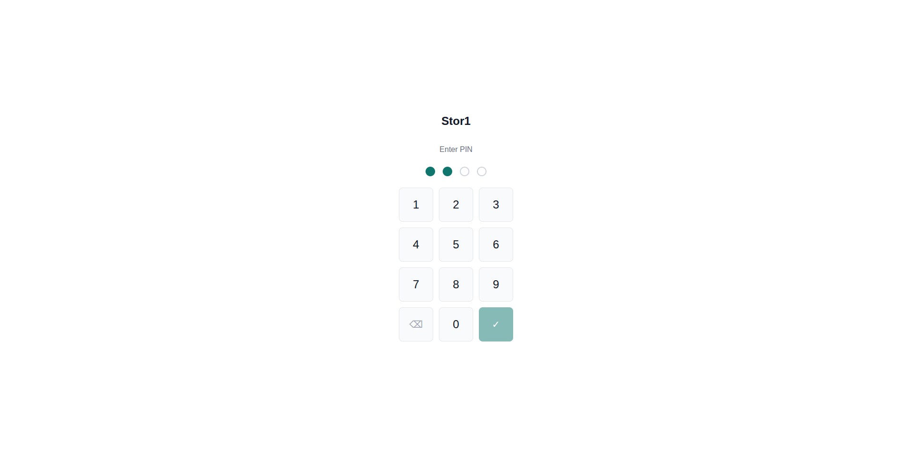</p>

### Staff Dashboard — Operational Hub
Real-time phone search with numpad input. Pending signature banner keeps therapist queue visible. One-tap access to check-in, customer list, and store management.

<p align="center">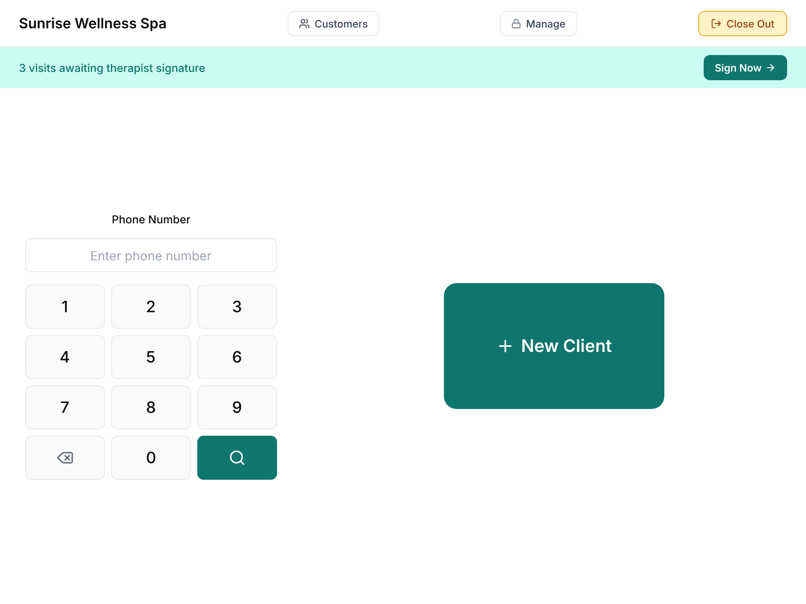</p>

### Customer Lookup — Instant Recognition
Phone search returns customer profile with visit count, last visit date, and health status badge. Global search finds customers across all stores.

<p align="center">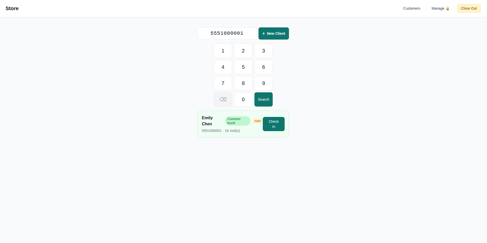</p>

### Multi-Step Intake Form
4-step wizard (Personal Info → Health Screening → Preferences → Consent & Signature) with real-time validation, autosave, and conditional fields.

<p align="center">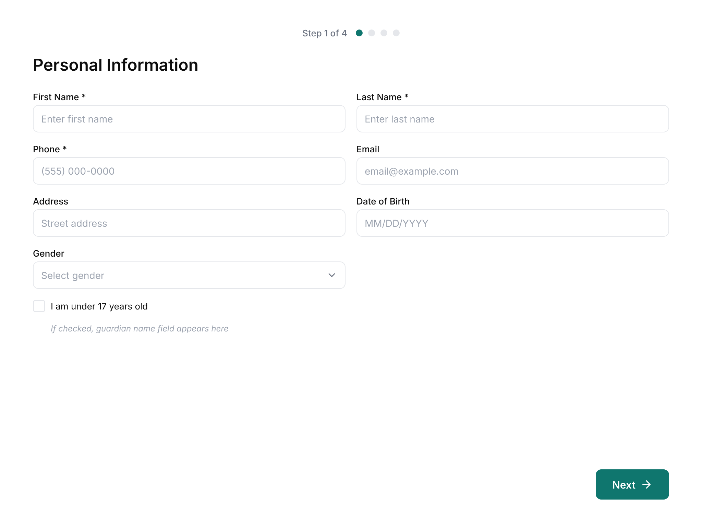</p>

### Form Validation
Real-time validation with clear error messaging. Required fields highlighted with contextual help text.

<p align="center">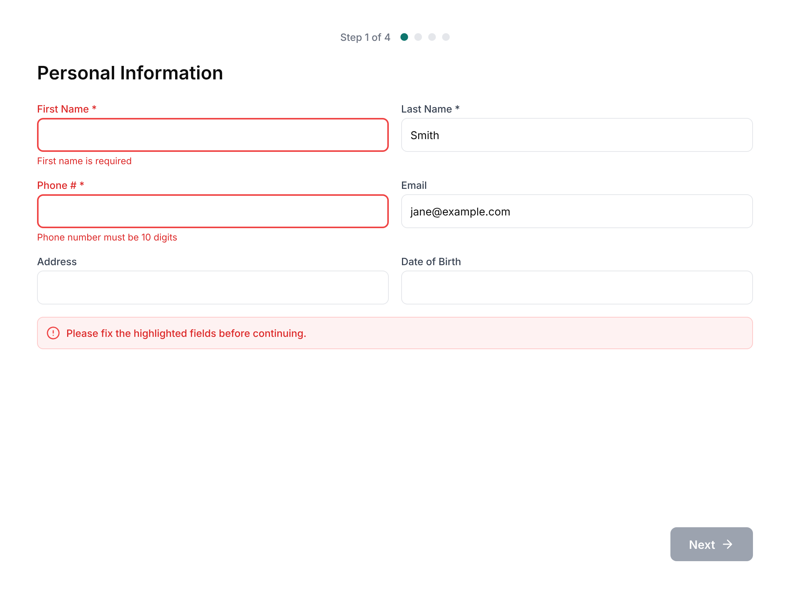</p>

### E-Signature & Legal Consent
Full consent text displayed before signature. Touch-optimized canvas captures finger signatures at 2x resolution. Signed forms generate downloadable PDF documents.

<p align="center">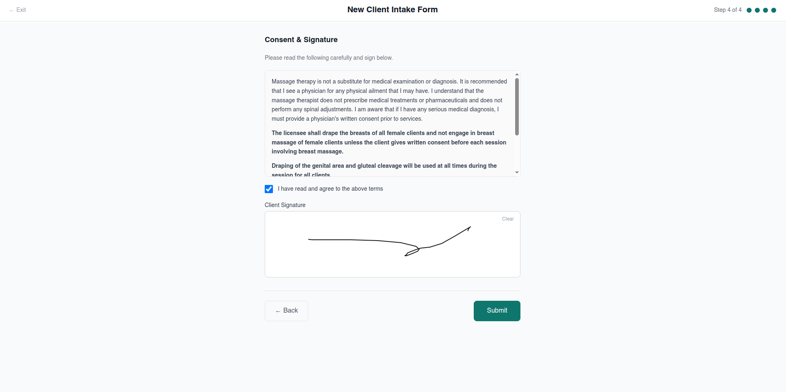</p>

### Returning Client Check-In
Health summary displayed before service — high blood pressure, allergies, areas to avoid are surfaced immediately. Loyalty points balance shown for discount eligibility.

<p align="center">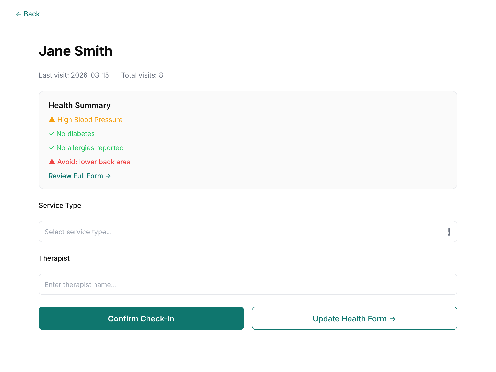</p>

### Customer Profile — Complete Record
Contact info, health badges, loyalty points with one-time import from physical punch cards, editable staff notes, and visit history with service technique tracking and points redemption status.

<p align="center">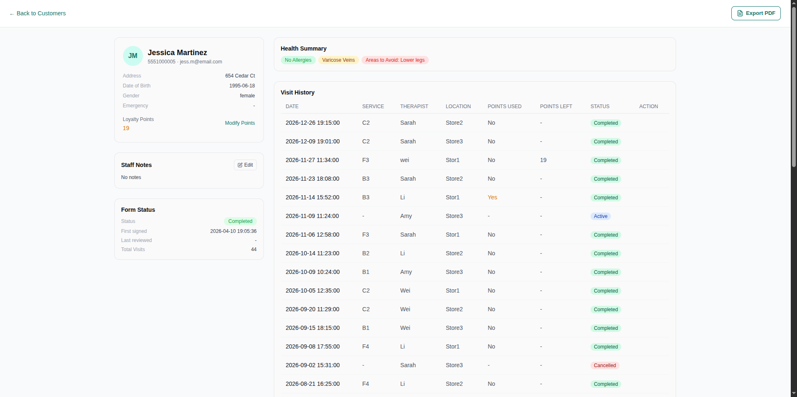</p>

### Therapist Signature Queue
After each service, therapists sign off from a prioritized queue. Position counter keeps orientation during batch signing. Health alerts shown before each signature.

<p align="center">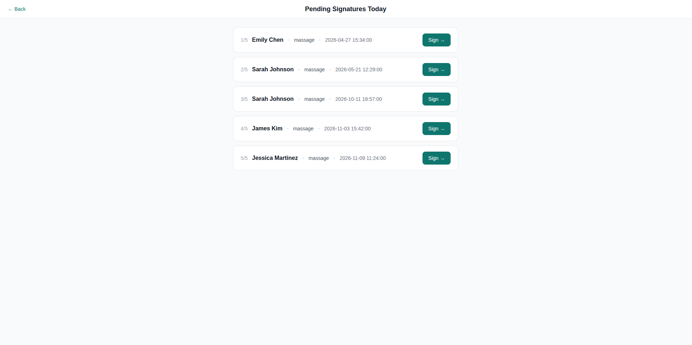</p>

### Queue Cleared State
When all pending visits are signed, the queue shows a clean empty state — providing clear visual confirmation to staff that no services are waiting.

<p align="center">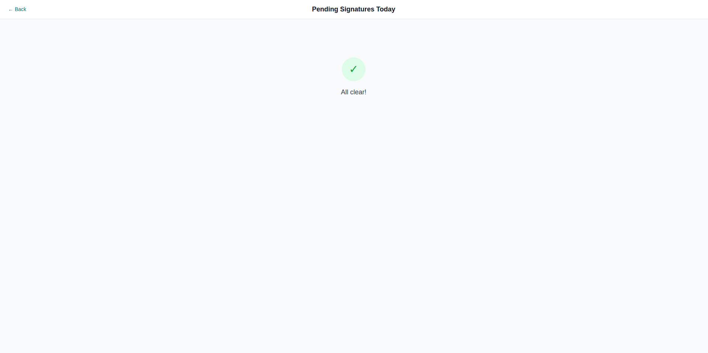</p>

### Therapist Record — Health-Alert-First Design
Health warnings displayed prominently above the signature form. Therapists record technique used and body parts treated. When client has 10+ loyalty points, a redemption toggle appears for applying the discount.

<p align="center">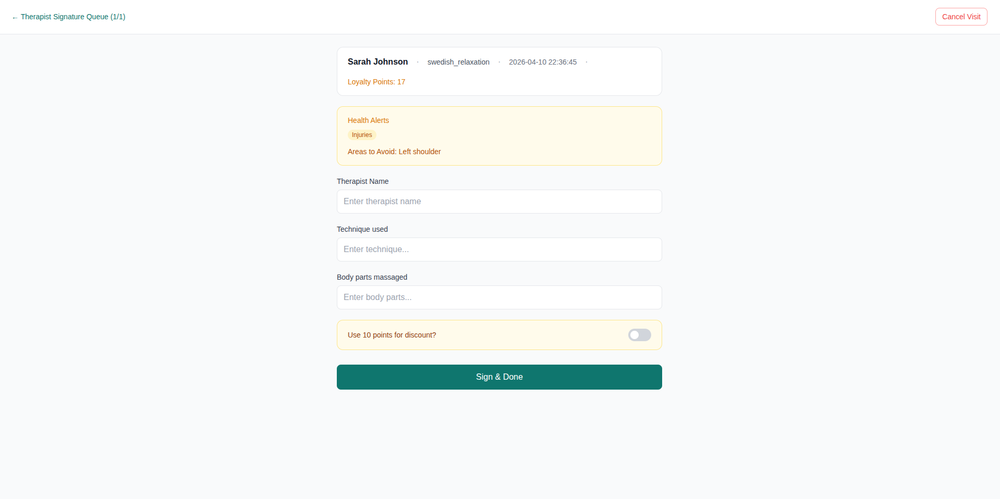</p>

### Store Management — Data & Analytics
Tabbed management interface with customer directory, visit log (cross-store global view), data export, general settings, and store configuration — all accessible via admin PIN.

<p align="center">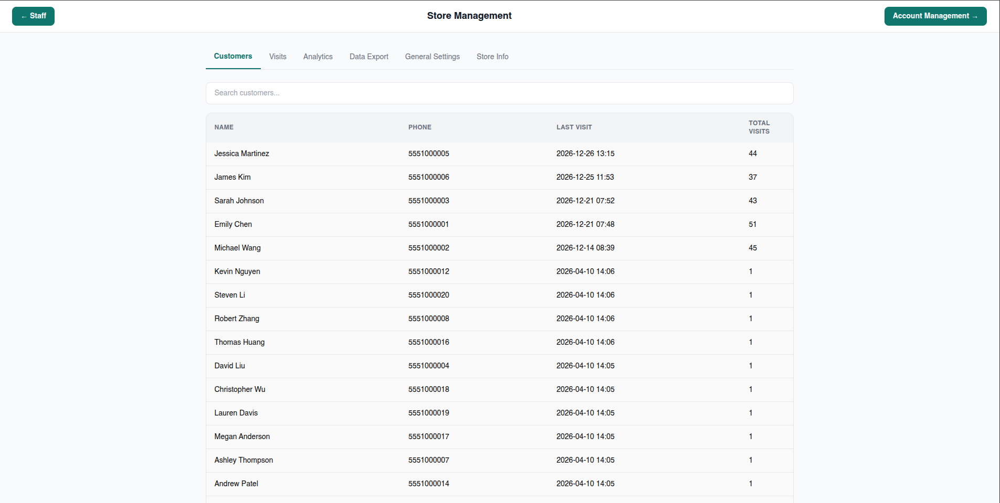</p>

### Account Management — Multi-Store Overview
Admin dashboard for managing multiple store locations. One-tap store entry, centralized account settings, and cross-store analytics access.

<p align="center">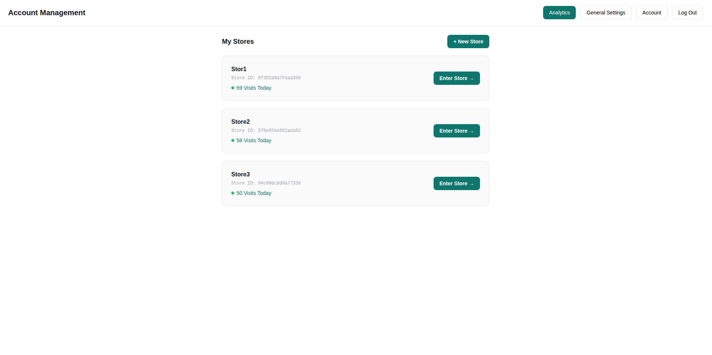</p>

---

## Analytics & Business Intelligence

The system includes two levels of analytics dashboards with interactive SVG visualizations and PDF export.

### Store-Level Dashboard
- **Visit Trend** — Intraday (hourly), weekly, monthly, and yearly views with interactive crosshair (stock-chart style touch interaction)
- **Service Mix** — Foot (F) / Body (B) / Combo (C) breakdown with period switching
- **Therapist Ranking** — Monthly/yearly service volume with stacked bar showing F/B/C split per therapist; fuzzy name clustering handles typos and case variations
- **Top Customers** — Top 5 most frequent visitors with service type breakdown
- **Cancellation Rate & Points Redemption** — Year-to-date metrics with monthly granularity

### Account-Level Dashboard (Cross-Store)
- **Store Comparison** — Multi-line chart comparing visit volumes across all locations
- **Customer Overview** — Total customers, new customer growth trend, cross-store customer ratio
- **Points System Overview** — Total issued vs redeemed, $50/redemption tracking, per-store breakdown
- **Service Mix (Global)** — F/B/C distribution across all stores
- **Store Cancellation Rates** — Side-by-side comparison for identifying operational issues
- **Top Customers** — Switchable view: by service type or by store distribution

#### Store-Level Dashboard Preview

<p align="center">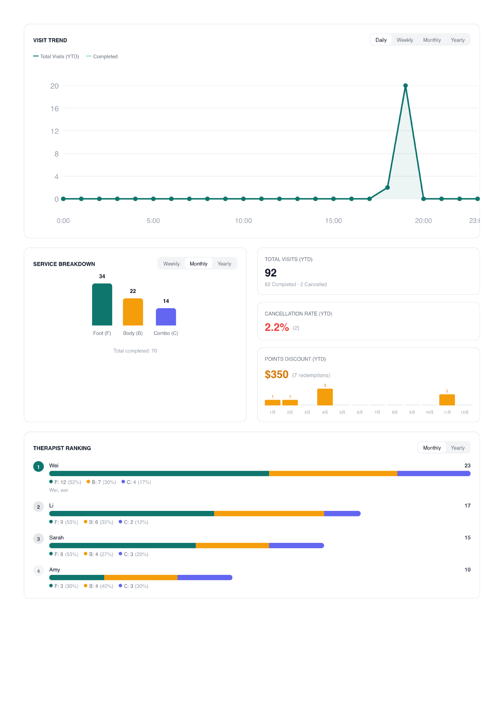</p>
<p align="center">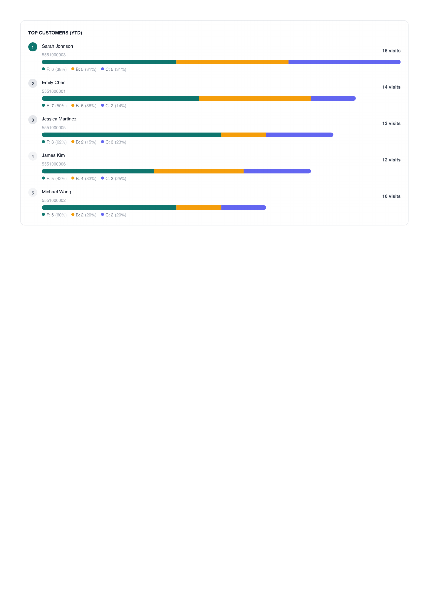</p>

#### Account-Level Dashboard Preview

<p align="center">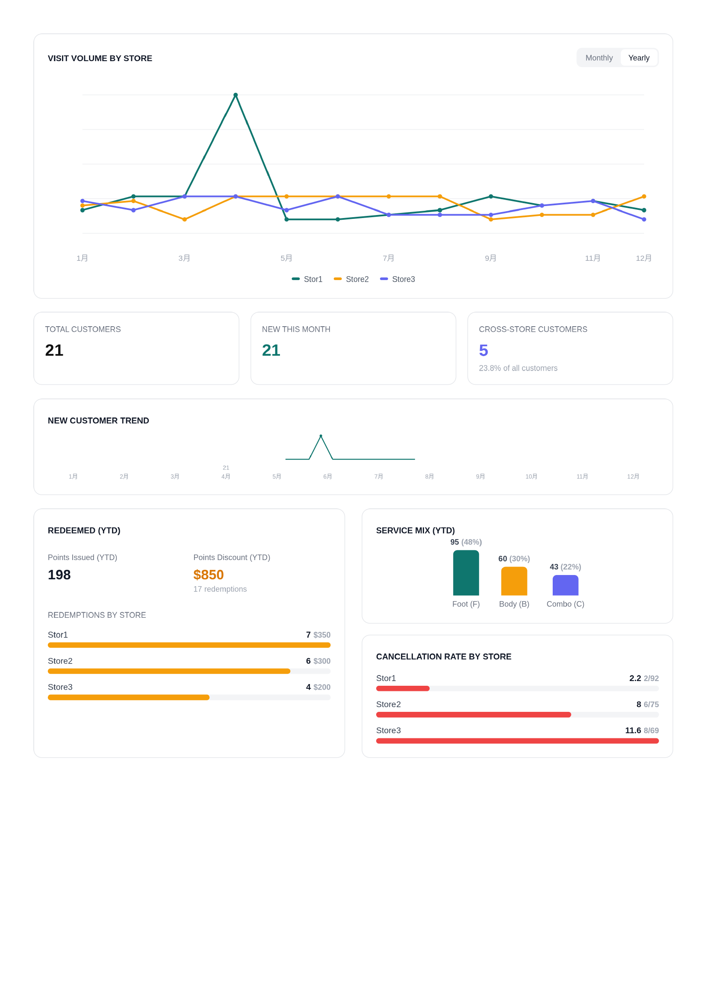</p>
<p align="center">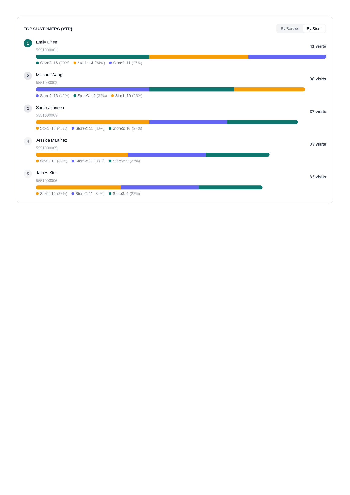</p>

> Full PDF exports available in [docs/pdf_demo/](docs/pdf_demo/)

---

## Loyalty Points System

A digital punch card system that replaces physical loyalty cards:

| Feature | Detail |
|---------|--------|
| **Earning** | +1 point per completed visit (auto on therapist signature, not earned when redeeming) |
| **Redemption** | 10 points = $50 discount (toggle at therapist sign-off); redemption visit does not earn a point |
| **Cross-Store** | Points shared across all locations (tied to customer, not store) |
| **Physical Card Import** | Staff can do a one-time import of existing punch card balances |
| **Admin Override** | Managers can manually adjust points with admin PIN verification |
| **Audit Trail** | Every visit records points redeemed and remaining balance |
| **Race-Safe** | Atomic SQL guards prevent concurrent double-redemption or negative balances |

---

## Key Features

- **iPad-First PWA** — Installable on iPad home screen, all interactions designed for touch
- **Dual-Layer Authentication** — Admin accounts (JWT, 30-day) for ownership; Store PINs (staff/admin) for daily operations
- **Three-Level Access Control** — `staff` → `customer` → `admin` state machine governs device handoff on a single shared iPad
- **Multi-Step Intake** — 4-step health questionnaire with Zod validation (shared frontend/backend), autosave, and draft restoration
- **E-Signature & PDF** — Canvas-based signature capture; client-side PDF generation for consent documents and analytics reports
- **Health Alert System** — Color-coded badges surfaced at every touchpoint
- **Therapist Queue** — Pending signature workflow with position tracking and batch signing
- **Loyalty Points** — Digital punch card with earning, redemption, import, and admin override
- **Analytics Dashboards** — Store-level and account-level business intelligence with interactive SVG charts
- **Multi-Store, Multi-Device** — One admin manages multiple locations; multiple iPads per store with session sync
- **Global Customer Search** — Fuzzy search by name or phone across all stores
- **Data Export** — CSV export of customer and visit data; PDF export of analytics dashboards; bulk consent form export as ZIP (date-range filtered, timezone-aware)
- **i18n** — English and Chinese (Simplified) with runtime switching
- **Zero-Ops Deployment** — Entire stack on Cloudflare (Workers + D1 + Pages)

---

## Architecture

```
┌─────────────────────────────────────────────────┐
│  iPad / Browser (PWA)                           │
│  React 18 + TypeScript + TailwindCSS            │
│  Zustand (state) + TanStack Query (cache)       │
│  SVG Charts + html2canvas + jsPDF               │
└──────────────────────┬──────────────────────────┘
                       │ HTTPS
                       v
┌──────────────────────────────────────────────────┐
│  Cloudflare Workers — API (Hono)                 │
│  JWT auth · Zod validation · PBKDF2 hashing      │
│  45+ endpoints · 4 auth layers                   │
└──────────────────────┬───────────────────────────┘
                       │ D1 binding
                       v
┌──────────────────────────────────────────────────┐
│  Cloudflare D1 — SQLite                          │
│  7 tables · FK constraints · CHECK constraints   │
│  Atomic batch ops · Cross-store data model       │
└──────────────────────────────────────────────────┘
```

### Data Model (7 Tables)

```
admins ──< stores ──< store_sessions
                  ──< visits >── customers ──< intake_forms
invite_codes
```

- **Customers are cross-store** — shared by phone number, accessible from any location
- **One intake form per customer** — updated in place with version tracking
- **Visits link customer × store** — each visit records service type, therapist, technique, loyalty points, and signature
- **Store sessions** — open/close cycle independent of calendar dates

---

## Business Analysis Highlights

### Measurable Impact
- Reduced new-client intake from **5-10 minutes** (paper) to **<2 minutes** (digital with autosave)
- Eliminated repeat health questionnaires for returning clients — **one-time intake** across all locations
- Replaced physical punch cards with tracked digital loyalty system — every redemption auditable ($50/use)
- Enabled data-driven decisions with real-time analytics — previously zero visibility into therapist utilization, service mix, or customer frequency

### Requirements Engineering
- Conducted on-site observation of paper-based workflow at multiple spa locations
- Mapped as-is process to to-be digital workflow through stakeholder interviews
- Identified 7 distinct user stories spanning 3 actor types (Client, Staff, Admin)
- Prioritized features using MoSCoW method across 5 development phases
- Phased delivery with CI test scripts at each phase (155+ automated test cases)

### Process Design

**Device Handoff Protocol** — A single shared iPad transitions securely between three roles:

```
accessLevel = staff (default, persistent)
    │
    ├── "New Client" / "Update Health Form"
    │       → accessLevel = customer (temporary, iPad handed to client)
    │       → client fills form → submits → Thank You page
    │       → staff enters PIN → back to staff
    │
    ├── [Manage] → admin PIN
    │       → accessLevel = admin (temporary)
    │       → leave /manage/* route → auto-fallback to staff
    │
    └── Close Out → PIN confirm → store session closed → all devices notified
```

**Session Lifecycle** — Business hours decoupled from calendar dates:

| Scenario | Behavior |
|----------|----------|
| First iPad arrives, enters PIN | No active session → create one |
| Second iPad arrives | Active session exists → join without PIN |
| Close Out initiated | Checks store-wide pending signatures first |
| Close Out succeeds | Session closed, all devices receive HTTP 410 → auto-exit |

### Data Architecture
- Normalized 7-table schema with cross-store customer deduplication (phone as natural key)
- Customers have no `store_id` — belonging derived through visit records, enabling seamless cross-store sharing
- Health data stored as structured JSON, computed into real-time risk badges
- Loyalty points tracked at customer level with per-visit audit trail (`points_redeemed`, `points_after`)
- Visit history enables frequency analysis, therapist utilization, service mix reporting, and loyalty analytics

### Concurrency Design

| Race Condition | Resolution |
|----------------|------------|
| Two devices create same customer | `phone UNIQUE` constraint → second request returns existing |
| Two devices sign same therapist record | `therapist_signed_at IS NULL` precondition → 409 |
| Two concurrent loyalty redemptions | Atomic SQL `CASE` guard → only first succeeds, no negative balances |
| Two concurrent points imports | `WHERE loyalty_imported_at IS NULL` → only first writes |
| Two devices close out simultaneously | First succeeds, second receives 410 |

### Analytics Design
- Store-level metrics scoped to individual store for operational decisions
- Account-level metrics aggregated across all stores for strategic oversight
- Therapist name fuzzy clustering (Levenshtein distance + anagram detection) handles real-world input variance
- Service type classification by technique code prefix (F/B/C) with graceful handling of free-text input
- All charts rendered as inline SVG — no external chart library dependency, minimal bundle impact

### API Design
45+ RESTful endpoints across 4 authentication levels:

| Auth Layer | Middleware | Example Endpoints |
|-----------|-----------|-------------------|
| Public | None | Register, Login, Store PIN |
| Store Staff | Store JWT | Customer search/lookup, Intake CRUD, Visit create, Therapist sign, Points import |
| Store Admin | Store JWT + `role=store_admin` | Customer/visit queries (global), Analytics, CSV/PDF/bulk form export, Points modify |
| Account Admin | Admin JWT | Multi-store CRUD, Cross-store analytics, PIN management |

---

## Tech Stack

| Layer | Technology | Why |
|-------|-----------|-----|
| Frontend | React 18, TypeScript, Vite | Component-based UI with type safety |
| Styling | TailwindCSS | Rapid prototyping, touch-friendly sizing |
| State | Zustand + TanStack Query | Local state + server cache separation |
| Forms | React Hook Form + Zod | Multi-step form with shared validation |
| Charts | Custom SVG | Zero-dependency, interactive touch support |
| PDF Export | html2canvas-pro + jsPDF | Pixel-perfect dashboard capture |
| Consent PDF | @react-pdf/renderer + JSZip | Structured legal document generation; bulk ZIP packaging |
| Signature | react-signature-canvas | Touch-optimized canvas drawing |
| API | Hono on Cloudflare Workers | Edge-deployed, <50ms cold start |
| Database | Cloudflare D1 (SQLite) | Zero-config, auto-replicated |
| Auth | JWT + PBKDF2 | Stateless tokens, secure PIN hashing |
| Hosting | Cloudflare Pages + Workers | Global CDN, zero-ops |
| i18n | Custom implementation | English + Chinese runtime switching |

---

## Project Structure

```
spa-crm/
├── frontend/               # React PWA
│   └── src/
│       ├── components/         # Reusable UI (Charts, TopCustomers, VisitHistory...)
│       ├── pages/              # Route-level pages (admin/, store/, public/)
│       │   ├── admin/              # Account analytics, customer detail, dashboard
│       │   ├── store/              # Staff main, customer list/profile, store management
│       │   └── public/             # Landing, login, register, intake form
│       ├── store/              # Zustand global state
│       ├── lib/                # API client (401/410 handling), PDF export
│       └── i18n/               # Locale files (en, zh)
├── backend/                # Cloudflare Worker
│   └── src/
│       ├── routes/             # API endpoints (auth, customers, visits, manage, admin)
│       ├── middleware/         # JWT verification, role guards, FK enforcement
│       ├── lib/                # Crypto, ID generation, CSV builder
│       └── db/                 # Schema SQL
├── shared/                 # Cross-boundary types & Zod schemas
├── tests/                  # Integration test scripts (155+ test cases)
│   └── acceptance/             # Acceptance criteria documents
└── docs/
    ├── screenshots/            # Production iPad screenshots
    └── pdf_demo/               # Sample analytics PDF exports
```

---

## Local Development

```bash
# Prerequisites: Node.js 18+, npm
npm install

# Start API (Cloudflare Workers local dev)
npm run dev:api     # http://localhost:8787

# Start frontend (Vite dev server)
npm run dev:web     # http://localhost:5173
```

Create `backend/.dev.vars` for local secrets:
```
JWT_SECRET=your-dev-secret-here
```

---

## Deployment

The entire application runs on Cloudflare's edge network:

- **Frontend**: Cloudflare Pages (global CDN)
- **API**: Cloudflare Workers (Hono, edge-deployed)
- **Database**: Cloudflare D1 (managed SQLite, auto-replicated)
- **Secrets**: `wrangler secret` for production JWT_SECRET

Zero server management. Zero monthly cost at current scale.

---

## License

Source code is shared for viewing, educational, and portfolio review purposes only. Not licensed for commercial use or redistribution. See [LICENSE](LICENSE) for details.
